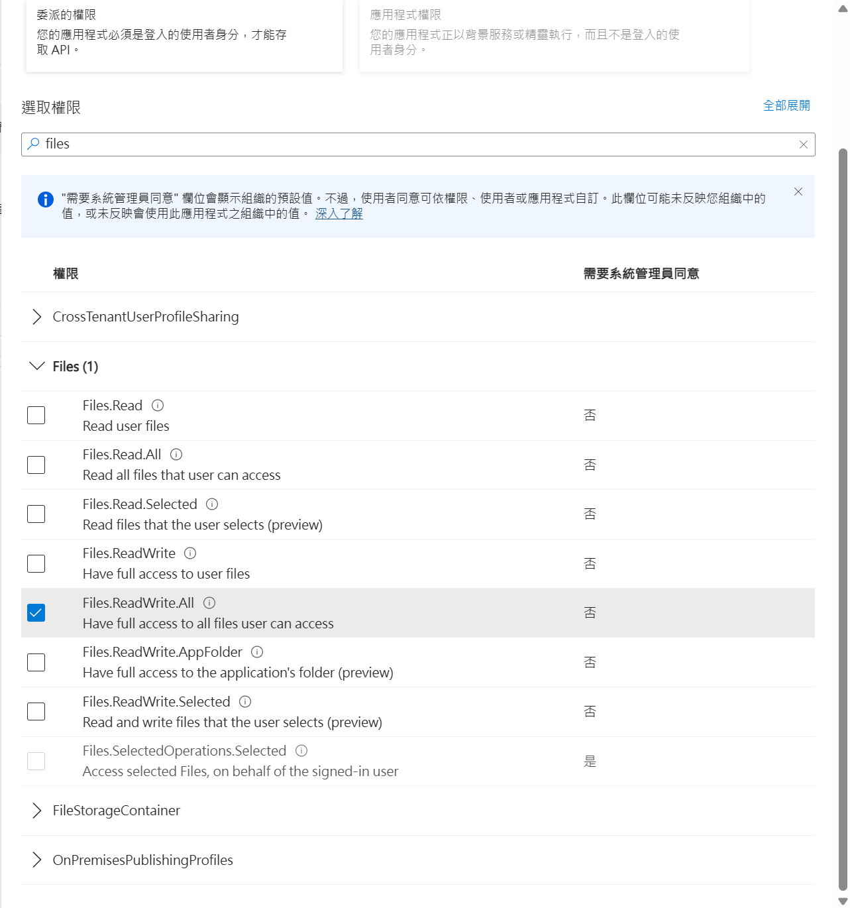

# [適用於 Alist 的 OneDrive 授權工具](https://github.com/Moranjianghe/onedrive-callback)

此項目廢棄，替代：[Moranjianghe/onedrive\-licensing\-tool\-for\-alist](https://github.com/Moranjianghe/onedrive-licensing-tool-for-alist)

>項目 [AlistGo/alist](https://github.com/AlistGo/alist) 由個人開發者轉由企業維護後，此前的回傳頁面 `https://alist.nn.ci/tool/onedrive/callback` 已經無法正常使用，官網文檔也無法正常查看，加之大家對原先的驗證方式亦有隱私權的顧慮，故編寫了兩個簡單的頁面和一個使用教程。

>本工具旨在協助用戶自行完成 OneDrive 授權，適用於 Alist 等第三方掛載場景，無需將敏感資訊交給他人。

>中間跑通了一次，但是我現在搞不明白是爲什麼了，因爲根據微軟的文檔，靜態網頁應該無法獲取 web 平臺的 refresh token，而單頁應用程式的 token 在 alist 中又無法使用。

>目前還是不可用，我覺得要不乾脆開發個帶後端的吧。（

## 使用步驟

### 一、註冊 Azure 應用

1. 登入 [Azure 門戶](https://portal.azure.com/)
2. 新增應用，取得 `client_id`（Application (client) ID）
3. 在「重定向 URI」新增您的 GitHub Pages 頁面地址，例如：
   `https://<yourname>.github.io/onedrive-callback/onedrive-callback.html`，平台選「Web」
4. 選擇正確的應用程序類型：
   - **重要**: 在「身份驗證」頁面，選擇平台類型為「**Web**」（推薦用於 Alist）
   - 請勿選擇「單頁應用 (SPA)」，這會導致 Alist 無法使用相應的 token
   - 重定向 URI 設定必須與授權頁面指定的一致

5. 配置 API 權限：
   - 進入「API 權限」頁面
   - 點擊「添加權限」> 選「Microsoft Graph」>「委託的權限」
   - 搜尋 `Files`，勾選所需權限（如 Files.ReadWrite.All）
   - 點擊「添加權限」保存

   

> ⚠️ **應用類型和 API 權限配置非常重要！**
> - 應用類型必須設置為「Web」，否則 Alist 可能會出現 AADSTS90023 錯誤
> - 未正確配置 API 權限將導致授權後無法訪問 OneDrive 文件

### 二、發起授權

1. Fork 本項目，部署授權頁面到 GitHub Pages（可選）

2. 訪問您部署的 `onedrive-auth.html`，或使用[本項目線上工具](https://moranjianghe.github.io/onedrive-callback/onedrive-auth.html)

3. 填寫授權資訊：
   - `client_id`（Azure 應用註冊獲得）
   - `redirect_uri`（預設為同目錄下的 `onedrive-callback.html`，一般無需修改）
   - 選擇授權類型（一般選「國際版/個人/商業版」）
   - **選擇應用程序類型**（選擇「Web 應用」，必須與 Azure 門戶中設置的一致）

4. 點擊「跳轉微軟授權」，登入並同意授權，微軟將回傳授權碼（code）到回調頁面

### 三、回調與後續操作

1. 回調頁面（`onedrive-callback.html`）會顯示授權結果與 code
2. 複製 code，回到 Alist 後台進行掛載

### 四、Alist 掛載 OneDrive 詳細步驟

1. 進入 Alist 後台 > 儲存 > 添加
2. 基本配置：
   - 驅動選擇 `OneDrive`
   - 掛載路徑：如 `/onedrive`
   - 根文件夾路徑：預設 `/`，可自訂
   - 類型：依您的 OneDrive 類型選擇
3. 認證參數：
   - `client_id`：Azure 應用註冊獲得
   - `client_secret`：**留空**
   - `redirect_uri`：與 Azure 註冊及授權頁一致
   - 確認已配置 Files.ReadWrite.All、User.Read 等權限
   - 點擊「獲取刷新令牌」，系統自動跳轉授權頁
4. 完成授權後，複製 code 回 Alist，粘貼於「刷新令牌」欄，點擊「保存」
5. 驗證掛載：返回文件列表，確認 OneDrive 目錄可正常訪問

> ⚠️ **注意**：
>
> - `client_secret` 雖顯示必填，實際應留空
> - 若授權失敗，請重檢 API 權限與 redirect_uri 配置
> - 如遇錯誤 `AADSTS90023: Tokens issued for the 'Single-Page Application'...`，請確保在 Azure 門戶中將應用類型設為「Web」而非「單頁應用 (SPA)」，並在授權工具中選擇相對應的應用類型

## 參考資源

- [Alist 官方文件](https://github.com/AlistGo/docs/blob/main/docs/zh/guide/drivers/onedrive.md)
- [微軟 Azure 應用註冊文檔](https://learn.microsoft.com/zh-cn/azure/active-directory/develop/quickstart-register-app)
- [GitHub Pages 官方說明](https://pages.github.com/)

## 最后

<del>如遇其它技術問題，可在本項目 issue 區留言或提交討論。</del>代碼都是 AI 寫的，出了問題可以給我留言但我也不一定有能力處理。歡迎改善本項目。
